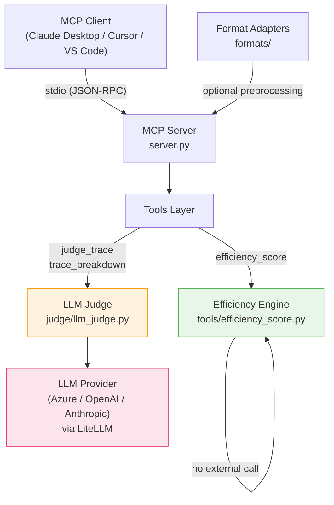

# Architecture

## System Overview

Agent Trace Intelligence is a Python MCP server that runs as a subprocess via stdio transport. The MCP client (Claude Desktop, Cursor, etc.) sends tool calls over stdin/stdout. No HTTP, no ports, no server to deploy for local use.



## Request Flow

### efficiency_score (no LLM)

```
Client → server.py → efficiency_score() → parse JSON → validate Pydantic → compute ratings → return JSON string
```

Entirely local. No network calls. Runs in < 10ms.

### judge_trace / trace_breakdown (LLM)

```
Client → server.py → judge_trace() → parse JSON → validate Pydantic → build prompt → call_judge() → LiteLLM → LLM provider → extract JSON → return JSON string
```

Network call to LLM provider. Typically 2-8 seconds.

## Error Handling Contract

All tools catch ALL exceptions and return a structured JSON error string. The MCP client never sees a Python exception.

```
Tool function
  ├── json.JSONDecodeError → PARSE_ERROR
  ├── pydantic.ValidationError → INVALID_TRACE
  ├── empty steps → EMPTY_TRACE
  └── LLM failure → JUDGE_FAILED
```

## Module Dependency Graph

```
server.py
├── tools/judge_trace.py
│   ├── models/trace.py (AgentTrace)
│   └── judge/llm_judge.py (call_judge)
├── tools/trace_breakdown.py
│   ├── models/trace.py
│   └── judge/llm_judge.py
└── tools/efficiency_score.py
    └── models/trace.py

formats/
├── langchain.py → models/trace.py
├── openai_agents.py → models/trace.py
├── maf.py → models/trace.py (stub)
└── autogen.py → models/trace.py
```

## Format Adapter Flow (Optional)

Adapters are optional preprocessing helpers. Users can:
1. Pass raw framework traces through an adapter → get AgentTrace → serialize to JSON → pass to MCP tool
2. Or construct AgentTrace JSON directly and pass to MCP tool

The MCP tools themselves only accept AgentTrace JSON. Adapters live outside the request path.

## Data Flow: LiteLLM Model Abstraction

```
call_judge(system, user)
  → check JUDGE_MODEL env var
  → if gpt-* or azure/gpt-*: add response_format=json_object
  → litellm.acompletion(model=JUDGE_MODEL, ...)
  → parse JSON from response
  → fallback: strip markdown fences, extract {} block
```

Model switching requires only a `.env` change. The abstraction is complete.

## Transport

**v1:** stdio only. The server reads JSON-RPC from stdin, writes to stdout. Standard MCP stdio transport.

**v2 (planned):** SSE / Streamable HTTP via uvicorn for enterprise internal deployment. Requires auth middleware and session management. Deferred to v2.
